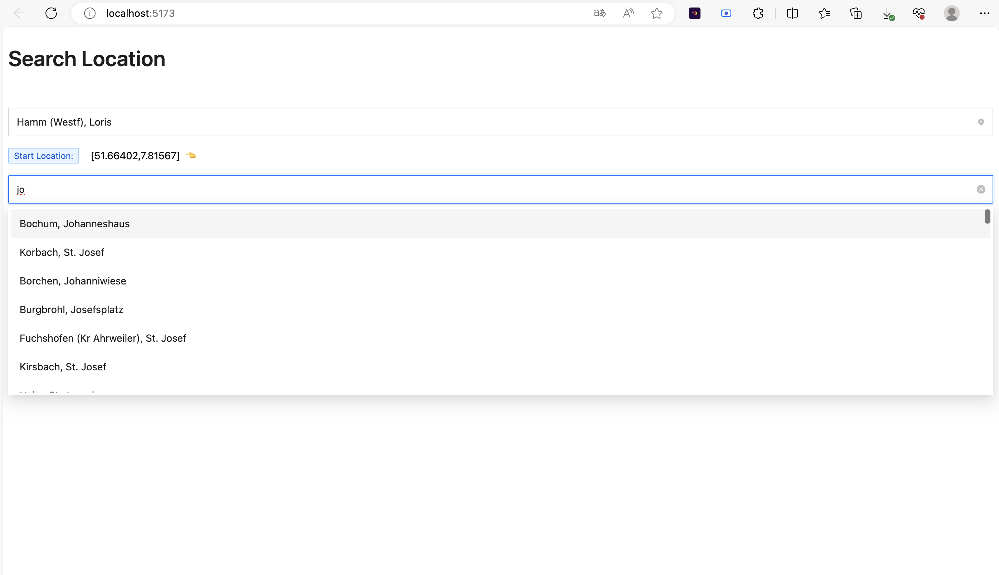

# Search Location



### installation

The project based on Vite, Typescript, AntDesign and tanstack reack query

1- Install dependencies with pnpm i or remove the file pnpm-lock.yaml and install with any other package manager (npm or yarn or ....)

2- After install you need to run the project with pnpm dev (npm run dev, yarn run dev ....)

3- When the project is running enjoy

### Explanation the stack

1- Vite and Typescript are often used together, and they form a powerful and fast development stack

2- AntDesign is more than just UI library, Is comprehensive design system for building enterprise-level applications

3- ReactQuery is not just a library to fetch data, It simplifies data fetching, caching, and state management.

### Explanation the solution

After create the component select, we need to fetch data linked to selected value from select.

In this case i use the power of ReactQuery to trigger any change in state (start, end), pass it as query, and fetch data

When the data is coming i reformat it because in the select i need

```
{
  value: ,
  lable: ,
  coords:
}
``
```
